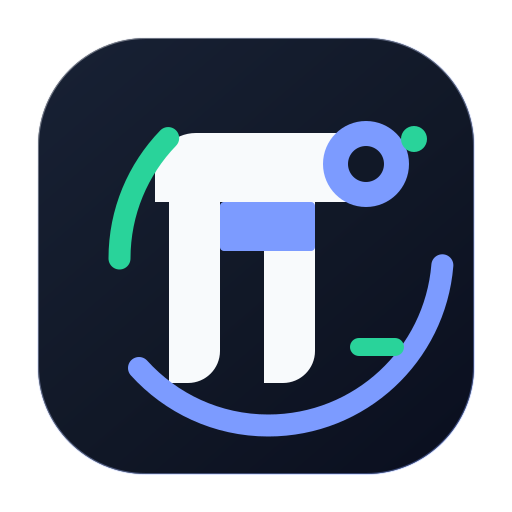

<p align="center">
  
</p>

<h1 align="center">Pi Studio Dev</h1>

<p align="center">
  面向 Windows 的 Pi 编程智能体桌面工作台。
</p>

<p align="center">
  <a href="https://github.com/s1oopX/pi-studio-dev/releases/latest"></a>
  
  <a href="LICENSE"></a>
</p>

<p align="center">
  <a href="README.md">English</a> ·
  <a href="https://github.com/s1oopX/pi-studio-dev/releases/latest">下载</a> ·
  <a href="packages/desktop/README.md">架构文档</a> ·
  <a href="https://github.com/earendil-works/pi">上游项目</a>
</p>

Pi Studio Dev 是 [earendil-works/pi](https://github.com/earendil-works/pi) 的独立社区 fork。项目保留上游的 Agent 运行时、编程助手 CLI、统一模型 API 和终端 UI，并增加完整的 Electron 桌面端，面向使用自有模型接口的个人开发者。

## 核心能力

- **并行智能体任务**：同时运行多个相互隔离的会话；后台任务持续执行；同一 Git 仓库可自动创建托管 worktree，避免任务互相覆盖。
- **本地、SSH 与 WSL 工作区**：本地和远程项目共用 Agent、Git、worktree、产物预览、项目信任与会话流程。
- **完整 Git 工作流**：在应用内查看改动、暂存和提交、推送、管理分支、审查 diff，并创建或查看 Pull Request。
- **自带模型接口**：支持 OpenAI 兼容接口和自定义端点，并提供 DeepSeek、通义千问和 Moonshot 快速预设；桌面后端不内置模型目录，也不依赖第一方 OAuth。
- **自动化与持久会话**：定时运行提示词、继续心跳会话、跟踪计划和目标、导入导出会话，并从磁盘恢复任务。
- **开发工作台**：预览文本、Markdown、HTML、图片、PDF、CSV、TSV 和 XLSX；支持终端标签页、图片生成、电脑控制和包资源。
- **安全边界**：渲染进程沙箱、上下文隔离、严格 IPC 白名单、工具审批模式、路径约束，以及默认不信任的项目资源。
- **中英文界面**：默认跟随操作系统语言，也可在设置中手动切换。

## 下载

从 [最新 Release](https://github.com/s1oopX/pi-studio-dev/releases/latest) 下载 `PiStudio-Dev-*.exe` 和 `SHA256SUMS`。

当前版本面向 64 位 Windows 10 和 Windows 11，以便携式可执行文件发布，无需安装。应用暂未进行代码签名，Windows SmartScreen 可能显示“未知发布者”；运行前请使用 `SHA256SUMS` 校验下载文件。

## 首次使用

1. 启动 Pi Studio Dev，在设置中添加模型服务商或自定义接口。
2. 打开本地文件夹、WSL 发行版或已保存的 SSH 主机。
3. 检查工作区信任提示，并选择工具审批模式。
4. 创建任务并开始工作；其他任务可在后台继续运行。

## 从源码运行

环境要求：Node.js 22.19+、Bun 1.3+、Git。

```bash
npm install --ignore-scripts
node node_modules/electron/install.js
npm run hydrate:model-data
npm --prefix packages/desktop start
```

架构、安全模型、日常开发流程和测试命令见 [packages/desktop/README.md](packages/desktop/README.md)。

## 仓库结构

| 包 | 用途 |
| --- | --- |
| [`packages/desktop`](packages/desktop) | Pi Studio Dev Electron 桌面应用 |
| [`packages/coding-agent`](packages/coding-agent) | 交互式编程助手 CLI 与桌面后端 |
| [`packages/agent`](packages/agent) | Agent 循环、工具与状态管理 |
| [`packages/ai`](packages/ai) | 统一多提供商 LLM API |
| [`packages/tui`](packages/tui) | 终端 UI 组件与增量渲染 |
| [`packages/server`](packages/server) | 服务端与 RPC 基础设施 |

## 上游与许可证

本 fork 的产品差异主要集中在 `packages/desktop`，单体仓库其他位置仅保留少量兼容性改动。上游工作归功于 [Earendil Works](https://github.com/earendil-works/pi)。

Pi Studio Dev 是独立项目，与 Earendil Works 不存在隶属或官方背书关系。项目采用 [MIT License](LICENSE)。
